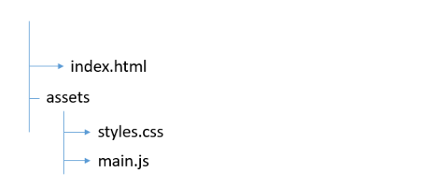

# Assignment 1

This assignment will involve a couple of steps.

__You are required to be familiar with basic HTML, CSS, Vscode, git and github. (Resources for these have been provided in Google Classroom for your reference). Ensure that your github account is linked to apprentice cloud replit__

1. You are required to create a project on vscode. The folder structure should be as shown the image below:

   

2. Push the created code to github using the git CLI.

3. Open assighnment 1 on replit and pull the files from your GitHub Repository to replit.
   
5. On your index.html file add a h1 tag and put in `Hello World` as the tag value.
6. In addition to the hello world, connect the main.js file to your HTML file
7. Have an input tag that accepts text and a button with a label `click me`.
8. Create a function on the main.js that allows you to fetch your name from the HTML input and display it on a HTML paragraph in this format, `Hello <your name>, welcome to the bootcamp`, when the `click me` button is clicked.
9. Test the code by running `npm test` on the shell an ensure your code pases all the tests.
10. Push your code from replit back to github and publish it on github pages.
11. Submit your replit project and share your github pages link on Google Classrrom Assignment 1. 

Yeey! first project bites the dust.
